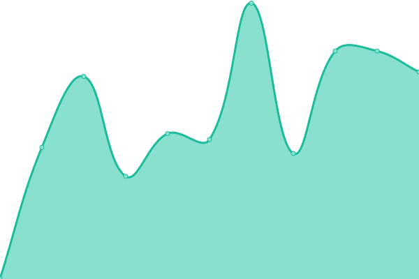
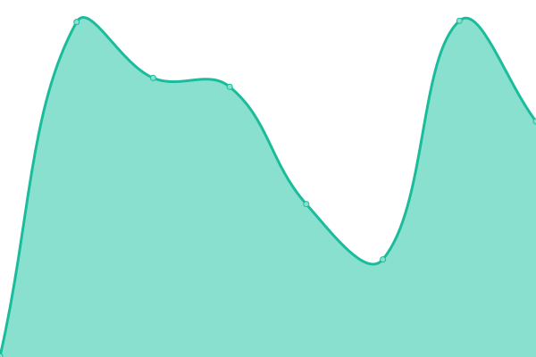
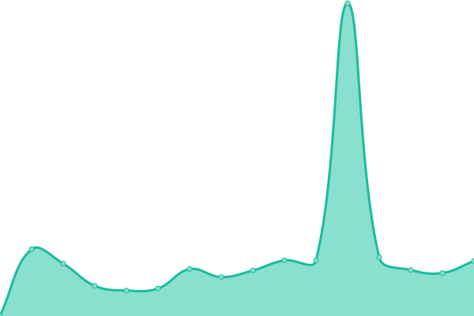
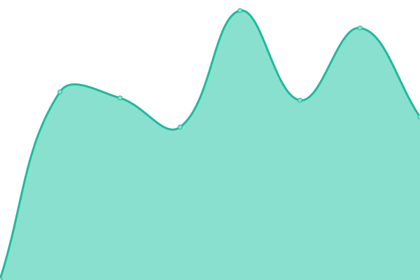
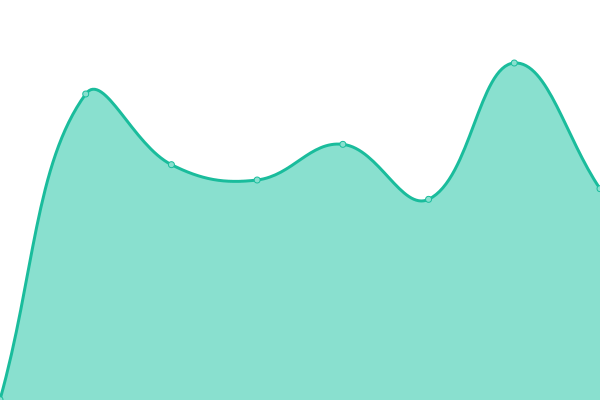

# [📈 Live Status](https://David-A-James.github.io/upptime): <!--live status--> **🟩 All systems operational**

This repository contains the open-source uptime monitor and status page for [David James](https://David-A-James.github.io/upptime), powered by [Upptime](https://github.com/upptime/upptime).

With [Upptime](https://upptime.js.org), you can get your own unlimited and free uptime monitor and status page, powered entirely by a GitHub repository. We use [Issues](https://github.com/David-A-James/upptime/issues) as incident reports, [Actions](https://github.com/David-A-James/upptime/actions) as uptime monitors, and [Pages](https://David-A-James.github.io/upptime) for the status page.

<!--start: status pages-->
<!-- This summary is generated by Upptime (https://github.com/upptime/upptime) -->
<!-- Do not edit this manually, your changes will be overwritten -->
<!-- prettier-ignore -->
| URL | Status | History | Response Time | Uptime |
| --- | ------ | ------- | ------------- | ------ |
|  [results (Public)](http://results.djames.org.uk/) | 🟩 Up | [results-public.yml](https://github.com/David-A-James/upptime/commits/HEAD/history/results-public.yml) | 

 454ms
     
 | 

<a href="https://David-A-James.github.io/upptime/history/results-public">100.00%</a>
    

|  [results2 (TSOHost)](http://results2.djames.org.uk/) | 🟩 Up | [results2-tso-host.yml](https://github.com/David-A-James/upptime/commits/HEAD/history/results2-tso-host.yml) | 

 255ms
     
 | 

<a href="https://David-A-James.github.io/upptime/history/results2-tso-host">100.00%</a>
    

|  [results5 (Digital Ocean Centos)](https://results5.djames.org.uk/) | 🟩 Up | [results5-digital-ocean-centos.yml](https://github.com/David-A-James/upptime/commits/HEAD/history/results5-digital-ocean-centos.yml) | 

 430ms
     
 | 

<a href="https://David-A-James.github.io/upptime/history/results5-digital-ocean-centos">100.00%</a>
    

|  [results6 (Pickaweb)](https://results6.djames.org.uk/) | 🟩 Up | [results6-pickaweb.yml](https://github.com/David-A-James/upptime/commits/HEAD/history/results6-pickaweb.yml) | 

 665ms
     
 | 

<a href="https://David-A-James.github.io/upptime/history/results6-pickaweb">100.00%</a>
    

|  [results7 (Digital Ocean Debian)](https://results7.djames.org.uk/) | 🟩 Up | [results7-digital-ocean-debian.yml](https://github.com/David-A-James/upptime/commits/HEAD/history/results7-digital-ocean-debian.yml) | 

 341ms
     
 | 

<a href="https://David-A-James.github.io/upptime/history/results7-digital-ocean-debian">100.00%</a>
    

|  [btrdarallyresults (Public)](http://results.btrdarallyresults.co.uk/) | 🟩 Up | [btrdarallyresults-public.yml](https://github.com/David-A-James/upptime/commits/HEAD/history/btrdarallyresults-public.yml) | 

 440ms
     
 | 

<a href="https://David-A-James.github.io/upptime/history/btrdarallyresults-public">100.00%</a>
    

|  [btrdarallyresults2 (TSOHost)](http://results2.btrdarallyresults.co.uk/) | 🟩 Up | [btrdarallyresults2-tso-host.yml](https://github.com/David-A-James/upptime/commits/HEAD/history/btrdarallyresults2-tso-host.yml) | 

 216ms
     
 | 

<a href="https://David-A-James.github.io/upptime/history/btrdarallyresults2-tso-host">100.00%</a>
    

|  [btrdarallyresults5 (Digital Ocean Centos)](https://results5.btrdarallyresults.co.uk/) | 🟩 Up | [btrdarallyresults5-digital-ocean-centos.yml](https://github.com/David-A-James/upptime/commits/HEAD/history/btrdarallyresults5-digital-ocean-centos.yml) | 

 389ms
     
 | 

<a href="https://David-A-James.github.io/upptime/history/btrdarallyresults5-digital-ocean-centos">100.00%</a>
    

|  [btrdarallyresults6 (Pickaweb)](https://results6.btrdarallyresults.co.uk/) | 🟩 Up | [btrdarallyresults6-pickaweb.yml](https://github.com/David-A-James/upptime/commits/HEAD/history/btrdarallyresults6-pickaweb.yml) | 

 502ms
     
 | 

<a href="https://David-A-James.github.io/upptime/history/btrdarallyresults6-pickaweb">100.00%</a>
    

|  [btrdarallyresults7 (Digital Ocean Debian)](https://results7.btrdarallyresults.co.uk/) | 🟩 Up | [btrdarallyresults7-digital-ocean-debian.yml](https://github.com/David-A-James/upptime/commits/HEAD/history/btrdarallyresults7-digital-ocean-debian.yml) | 

 292ms
     
 | 

<a href="https://David-A-James.github.io/upptime/history/btrdarallyresults7-digital-ocean-debian">100.00%</a>
    

|  [EMAMC (TSOHost)](https://emamc.org.uk/) | 🟩 Up | [emamc-tso-host.yml](https://github.com/David-A-James/upptime/commits/HEAD/history/emamc-tso-host.yml) | 

 600ms
     
 | 

<a href="https://David-A-James.github.io/upptime/history/emamc-tso-host">100.00%</a>
    

|  [BTRDAmembership (TSOHost)](https://btrdamembership.com/) | 🟩 Up | [btrd-amembership-tso-host.yml](https://github.com/David-A-James/upptime/commits/HEAD/history/btrd-amembership-tso-host.yml) | 

 1067ms
     
 | 

<a href="https://David-A-James.github.io/upptime/history/btrd-amembership-tso-host">100.00%</a>
    

|  [Bridlington (Home)](http://home.djames.org.uk/) | 🟩 Up | [bridlington-home.yml](https://github.com/David-A-James/upptime/commits/HEAD/history/bridlington-home.yml) | 

 552ms
     
 | 

<a href="https://David-A-James.github.io/upptime/history/bridlington-home">100.00%</a>
    

<!--end: status pages-->

[**Visit our status website →**](https://David-A-James.github.io/upptime)

## 📄 License

- Code: [MIT](./LICENSE) © [David James](https://David-A-James.github.io/upptime)
- Data in the `./history` directory: [Open Database License](https://opendatacommons.org/licenses/odbl/1-0/)
