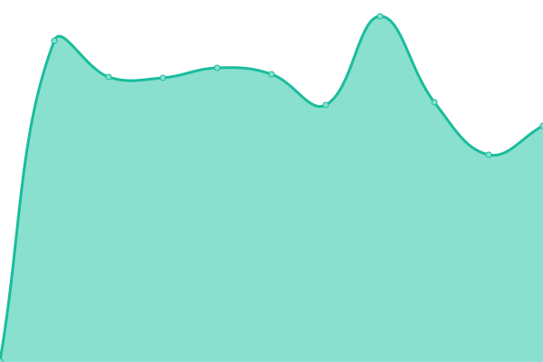
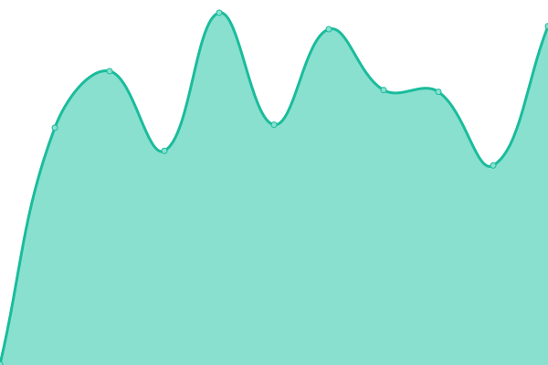
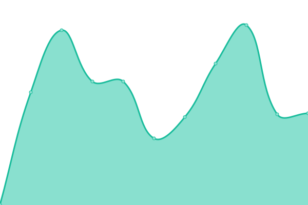
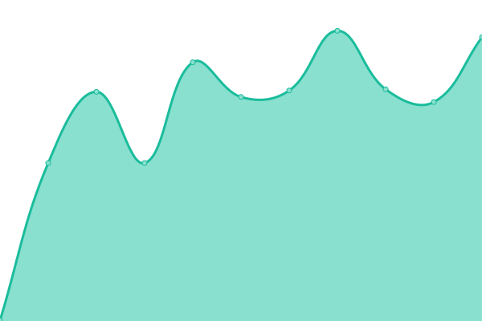

# [📈 Live Status](https://David-A-James.github.io/upptime): <!--live status--> **🟩 All systems operational**

This repository contains the open-source uptime monitor and status page for [David James](https://David-A-James.github.io/upptime), powered by [Upptime](https://github.com/upptime/upptime).

With [Upptime](https://upptime.js.org), you can get your own unlimited and free uptime monitor and status page, powered entirely by a GitHub repository. We use [Issues](https://github.com/David-A-James/upptime/issues) as incident reports, [Actions](https://github.com/David-A-James/upptime/actions) as uptime monitors, and [Pages](https://David-A-James.github.io/upptime) for the status page.

<!--start: status pages-->
<!-- This summary is generated by Upptime (https://github.com/upptime/upptime) -->
<!-- Do not edit this manually, your changes will be overwritten -->

| URL                                                               | Status | History                                                                                                                                | Response Time                                                                                      | Uptime                                                                                                                                                                                                                                                                 |
| ----------------------------------------------------------------- | ------ | -------------------------------------------------------------------------------------------------------------------------------------- | -------------------------------------------------------------------------------------------------- | ---------------------------------------------------------------------------------------------------------------------------------------------------------------------------------------------------------------------------------------------------------------------- |
| [results2 (TSOHost)](http://results2.djames.org.uk)               | 🟩 Up  | [results2-tso-host.yml](https://github.com/David-A-James/upptime/commits/master/history/results2-tso-host.yml)                         |  330ms             |                          |
| [results5 (Digital Ocean Centos)](https://results5.djames.org.uk) | 🟩 Up  | [results5-digital-ocean-centos.yml](https://github.com/David-A-James/upptime/commits/master/history/results5-digital-ocean-centos.yml) |  519ms |  |
| [results6 (Pickaweb)](https://results6.djames.org.uk)             | 🟩 Up  | [results6-pickaweb.yml](https://github.com/David-A-James/upptime/commits/master/history/results6-pickaweb.yml)                         |  527ms             |                          |
| [results7 (Digital Ocean Debian)](https://results7.djames.org.uk) | 🟩 Up  | [results7-digital-ocean-debian.yml](https://github.com/David-A-James/upptime/commits/master/history/results7-digital-ocean-debian.yml) |  315ms |  |

<!--end: status pages-->

[**Visit our status website →**](https://David-A-James.github.io/upptime)

## 📄 License

- Code: [MIT](./LICENSE) © [David James](https://David-A-James.github.io/upptime)
- Data in the `./history` directory: [Open Database License](https://opendatacommons.org/licenses/odbl/1-0/)
